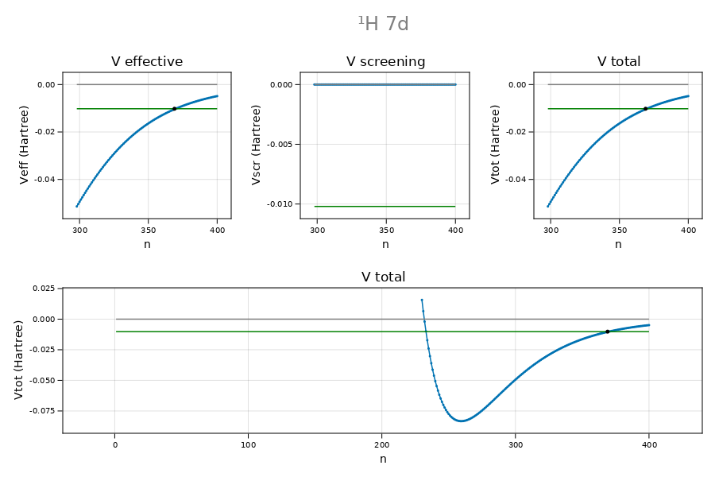

```@meta
CurrentModule = CamiXon
```

# CamiXon.jl

A package for image analysis of backscattered light

---
## Table of contents

```@contents
```

## Introduction

CamiXon is a package for the numerical solution of the radial Schrödinger
equation allowing for screening.

In this package the solution is obtained for a single electron, acting as a
*spectator* in the central field of the atomic nucleus screened by 'the other'
electrons (the *screening* electrons).

The starting point is the 1D Schrödinger equation,

```math
\tilde{χ}_{l}^{′′}+2[Z_{\mathrm{eff}}(ρ)/ρ-l(l+1)/2ρ^{2}+ε_{l}]\tilde{χ}_{l}=0,
```
where $\tilde{\chi}_{l}(\rho)=\rho\tilde{R}_{l}(\rho)$ is the reduced
radial wavefunction and $ε_{l}=-κ _{l}^{2}$ is the
corresponding binding energy in Hartree atomic units (a.u.). As compared
to the hydrogenic case, the atomic number ``Z`` has been replaced by
``Z_{\mathrm{eff}}(ρ)``, the *effective nuclear charge* at radial distance
``ρ`` from the atomic center (in a.u.). In other words, the energy of the
electron in the Coulomb field of the nucleus is replaced by an effective,
central field potential of the form

```math
U_{\mathrm{CF}}(ρ)=-Z_{\mathrm{eff}}(ρ)/ρ=-Z/ρ+U_{\mathrm{scr}}(ρ),
```

consisting of the bare Coulomb contribution, ``-Z/ρ``, and the screening field
``U_{\mathrm{scr}}(ρ)``, subject to the boundary conditions
``U_{\mathrm{scr}}(0)=Z`` and
``\mathrm{lim}_{ρ→\infty}U_{\mathrm{scr}}(ρ)=Z_{c}/ρ``.
Here ``Z_{c}`` is the Rydberg charge; i.e. the effective nuclear charge for a
spectator electron in the far field ``(ρ→\infty)``. Within these
assumptions we can optimize ``U_{\mathrm{scr}}(ρ)``, while preserving
the bare Coulomb field close to the nucleus as well as the Rydberg potential in
the far field. The price we pay is that the radial Schrödinger equation has to
be solved numerically by radial integration. Our strategy is to use both
*inward* and *outward* integration and match the two branches by
*equating the two solutions* for the *wavefunction*, ``χ(ρ)``, and its
*derivative*, ``χ^′(ρ)``, at a point near the classical turning point of the
radial motion of the electron. The basics of the solution can be found in the
book *Atomic Structure Theory* by Walter R. Johnson.

#### Illustration: the hydrogen 3d orbital

Shown below are the reduced radial wavefunction ``(χ)`` and its derivative
``(χ^′)`` in the near field (left), the far field (right), and in the region
about the classical turning point (center).


## Codata

```@docs
Codata
Value
strValue(f::Value)
NamedValue
castNamedValue(val::Value; name=" ", comment=" ")
castCodata(year::Int)
listCodata(codata::Codata)
convertUnit(val, codata::Codata; unitIn="Hartree", unitOut="xHz")
calibrationReport(E, Ecal, codata::Codata; unitIn="Hartree")
```

## Atomic properties

```@docs
Element
Isotope
Atom
Orbit
SpinOrbit
Term
listElement(Z::Int; fmt=Object)
listElements(Z1::Int, Z2::Int; fmt=Object)
castElement(;Z=1, msg=true)
listIsotope(Z::Int, A::Int; fmt=Object)
listIsotopes(Z1::Int, Z2::Int; fmt=Object)
latexIsotopeTable(Z1::Int, Z2::Int; continuation=false)
castIsotope(;Z=1, A=1, msg=true)
listAtom(Z::Int, A::Int, Q::Int; fmt=Object)
listAtoms(Z1::Int, Z2::Int, Q::Int; fmt=Object)
castAtom(;Z=1, A=1, Q=0, msg=true)
castOrbit(;n=1, ℓ=0, msg=true)
createSpinOrbit(o::Orbit; up=true, msg=true)
createTerm(n::Int; ℓ=0, S=1//2, L=0, J=1//2, msg=true)
bohrformula(Z::Int, n::Int)
```

## Grid

The `Grid` object is the backbone for the numerical procedure on a non-uniform
grid. Its principal fields are `grid.r` and `grid.r′`, which are discrete
functions of `N` elements representing the grid function and its derivative.

```@docs
Grid{T}
gridname(ID::Int)
gridfunction(ID::Int, n::Int, h::T; p=5, coords=[0,1], deriv=0) where T <: Real
castGrid(ID::Int, N::Int, T::Type; h=1, r0=0.001,  p=5, coords=[0,1], epn=7, k=7, msg=true)
autoRmax(atom::Atom, orbit::Orbit)
autoNtot(orbit::Orbit)
autoPrecision(Rmax::T, orbit::Orbit) where T<:Real
autoSteps(ID::Int, Ntot::Int, Rmax::T; p=5, coords=[0,1]) where T<:Real
autoGrid(atom::Atom, orbit::Orbit, codata::Codata, T::Type ; p=0, coords=[], Nmul=1, epn=7, k=7, msg=true)
grid_differentiation(f::Vector{T}, grid::Grid{T}; k=3) where T<:Real
grid_trapezoidal_integral(f::Vector{T}, n1::Int, n2::Int, grid::Grid{T}) where T<:Real
```

## Adams-Moulton integration

The Adams-Moulton method is used for numerical integration of the reduces
radial wave equation. In the present implementation it is constructed on top
the objects [`Atom`](@ref), [`Orbit`](@ref), [`Grid`](@ref), [`Def`](@ref)
and [`Adams`](@ref) using 5 globally defined instances called `atom`, `orbit`,
`grid`, `def` and `adams`.

### Pos

The `Pos` object serves within [`Def`](@ref) object to contain the position
indices `def.Na`, `def.Nb`, `def.Nlctp`, `def.Nmin`, `def.Nuctp` used in
Adams-Moulton integration. These positions are contained in the fields
`def.pos.Na`, `def.pos.Nb`, `def.pos.Nlctp`, `def.pos.Nmin`, `def.pos.Nuctp`.
Alternatively, they can be determined with the functions [`get_Na`](@ref),
[`get_Nb`](@ref), [`get_Nlctp`](@ref), [`get_Nmin`](@ref), [`get_Nuctp`](@ref).
```@docs
Pos
```

### Def

The `Def` object serves to define the problem to be solved and to contain in
the field `def.Z` the solution as a discrete function of `N` elements.

#### Illustration: central field potential ``U_{\mathrm{CF}}`` versus grid index
NB. plot_potentials is not part of the package
```
atom = castAtom(Z=1, Q=0, M=1.00782503223, I=1//2, gI=5.585694713)
orbit = castOrbit(n=7, ℓ=2)
codata = castCodata(2018)
grid = autoGrid(atom, orbit, codata, Float64)
def = castDef(grid, atom, orbit)
E = convert(grid.T,bohrformula(atom.Z, orbit.n))
@printf "E = %.15g %s \n" E "Hartree"
adams = castAdams(E, grid, def)
plot_potentials(E, grid, def)
  Atom created: Hydrogen - ¹H (Z = 1, Zc = 1, Q = 0, M = 1.00782503223, I = 1//2, gI = 5.585694713)
  Orbit created: 7d - (n = 7, n′ = 4, ℓ = 2)
  create exponential Grid: Float64, Rmax = 207.0 (a.u.), Ntot = 400, h = 0.025, r0 = 0.00939821
  E = -0.0102040816326531 Hartree
  Nlctp = 234, Nmin = 259, Nuctp = 369 (Ructp = 93.0059202490 a.u.)
```


```@docs
Def{T}
castDef(grid::Grid{T}, atom::Atom, orbit::Orbit) where T <: Real
initE(def::Def{T}; E=nothing) where T<:Real
get_Na(Z::Vector{Complex{T}}, def::Def{T}) where T<:Real
get_Nb(Z::Vector{Complex{T}}, def::Def{T}) where T<:Real
get_Nlctp(E::T, def::Def{T}) where T<:Real
get_Nmin(def::Def{T}) where T<:Real
get_Nuctp(E::T, def::Def{T}) where T<:Real
get_nodes(Z::Vector{Complex{T}}, def::Def{T}) where T<:Real
```

```@docs
matG(E::T, grid::Grid{T}, def::Def{T}) where T<:Real
matσ(E::T, grid::Grid{T}, def::Def{T}) where T<:Real
matMinv(E::T, grid::Grid{T}, def::Def{T}, amEnd::T) where T<:Real
OUTSCH(grid::Grid{T}, def::Def{T}, σ::Vector{Matrix{T}}) where T<:Real
OUTSCH_WKB(E::T, grid::Grid{T}, def::Def{T}) where T<:Real
```

### Adams

The `Adams` object serves to hold the Adams-Moulton integration matrices
`matG`, `matσ`, `matMinv` as well as the *actual* normalized solution `Z` in
the form of a tabulated function of `N` elements.

```@docs
Adams
castAdams(E::T, grid::Grid{T}, def::Def{T}) where T<:Real
updateAdams!(adams::Adams{T}, E, grid::Grid{T}, def::Def{T}) where T<:Real
INSCH(E::T, grid::Grid{T}, def::Def{T}, adams::Adams{T}) where T<:Real
adams_moulton_inward(E::T, grid::Grid{T}, def::Def{T}, adams::Adams{T}) where T<:Real
adams_moulton_outward(def::Def{T}, adams::Adams{T}) where T<:Real
adams_moulton_normalized(Z::Vector{Complex{T}}, ΔQ::T, grid::Grid{T}, def::Def{T}) where T<:Real
solve_adams_moulton(E::T, grid::Grid{T}, def::Def{T}, adams::Adams) where T<:Real
```

## FITS

FITS stands for 'Flexible Image Transport System'. This is an open standard origionally developed for the astronomy community to store telescope images together with tables of spectral information. Over the years it has developed into a scientific standard - http://fits.gsfc.nasa.gov/iaufwg.

Within CamiXon only the basic FITS functionality is implemented for users not requiring celestal coordinates. The user can create, read and extend .fits files as well as create, edit and delete user-defined metainformation.

A FITS file consists of a sequence of one or more header-data-units (HDUs), each containing a data block preceeded by header records of metainformation.

By the command `f = fits_read(filnam)` we asign a collection of `FITS_HDU` objects from the file `filnam` to the variable `f`.

### FITS - Types

```@docs
FITS_HDU{T,V}
FITS_header
FITS_data
FITS_table
FITS_name
```

### FITS - HDU Methods

```@docs
fits_info(hdu::FITS_HDU)
parse_FITS_TABLE(hdu::FITS_HDU)
```

### FITS - File Methods

```@docs
cast_FITS_name(filename::String)
fits_combine(filnamFirst::String, filnamLast::String; protect=true)
fits_copy(filenameA::String, filenameB::String=" "; protect=true)
fits_create(filename::String, data=[]; protect=true)
fits_extend(filename::String, data_extend, hdutype="IMAGE")
fits_read(filename::String)
```

### FITS - Key Methods

```@docs
fits_add_key(filename::String, hduindex::Int, key::String, val::Real, com::String)
fits_delete_key(filename::String, hduindex::Int, key::String)
fits_edit_key(filename::String, hduindex::Int, key::String, val::Real, com::String)
fits_rename_key(filename::String, hduindex::Int, keyold::String, keynew::String)
```

## FORTRAN

```@docs
FORTRAN_format
cast_FORTRAN_format(str::String)
cast_FORTRAN_datatype(str::String)
```

## Plotting

```@docs
step125(x::Real)
select125(x)
steps(x::Vector{T} where T<:Real)
stepcenters(x::Vector{T} where T<:Real)
stepedges(x::Vector{T} where T<:Real)
edges(px, Δx=1.0, x0=0.0)
```

## Search and conversion tools

```@docs
find_all(A::Union{String,AbstractArray{T,1}}, a::T...; count=false)  where T
find_first(A::Union{String,AbstractArray{T,1}}, a::T...; dict=false)  where T
find_last(A::Union{String,AbstractArray{T,1}}, a::T...; dict=false)  where T
```

## Math

```@docs
bernoulli_numbers(nmax::Int)
canonical_partitions(n::Int, m=0; header=true, reverse=true)
faulhaber_polynom(p::Int)
faulhaber_summation(n::Int, p::Int; T=Int)
harmonic_number(n::Int, p::Int)
harmonic_number(n::Int)
integer_partitions(n::Int, m=0; transpose=false, count=false)
log10_characteristic_power(x)
log10_mantissa(x)
permutations_unique_count(p::Array{Array{Int64,1},1}, i::Int)
pascal_triangle(nmax::Int)
pascal_next(a::Vector{Int})
pochhammer(x::T, p::Int) where T<:Real
polynomial(coords::Vector{T}, x::T; deriv=0) where T<:Number
polynom_derivative(coords::Vector{<:Number})
polynom_derivatives(coords::Vector{<:Number}; deriv=0)
polynom_derivatives_all(coords::Vector{<:Number})
polynom_power(coords::Vector{<:Number}, power::Int)
polynom_powers(coords::Vector{<:Number}, pmax::Int)
polynom_primitive(coeffs::Vector{<:Number})
polynom_product(a::Vector{T}, b::Vector{T}) where T<:Number
polynom_product_expansion(a::Vector{T}, b::Vector{T}, p::Int) where T<:Number
texp(x::T, a::T, p::Int) where T <: Real
VectorRational
normalize_VectorRational(vec::Vector{Rational{Int}})
```

## Finite-difference methods

### Finite differences

Consider the analytical function ``f`` tabulated in *forward order*  
(growing index) at ``n`` positions on a *uniform grid*.

**Forward difference notation**

In *forward difference* notation, the *finite difference* of two adjacent
values on the grid is defined as

```math
Δ f[n] = f[n+1]-f[n],
```

where ``Δ`` is the forward difference operator. By a formal inversion  
procedure we find

```math
f(x-1)=(1+Δ)^{-1}=(1-Δ+Δ^2-Δ^3+⋯)f(x),
```

where ``Δ^k`` is the  ``k^{th}``-*order forward difference*. It is defined as
a *weighted sum* over the function values ``f[n:n+k]`` (involving
``k+1`` points),

```math
Δ^k f[n] = c_{k}^kf[n] + c_{k-1}^kf[n+1] + ⋯  + f[n+k]
= \sum_{j=0}^{k} c_{k-j}^k f[n+j].
```
The ``k+1`` coefficients

```math
c_{k-j}^{k}=(-1)^{k-j}\binom{k}{j}
```

are the *summation weights* (short: *weights*) which define the summation.

**Backward difference notation**

In *backward difference* notation, the *finite difference* of two adjacent
values on the grid is defined as

```math
∇ f[n] = f[n]-f[n-1],
```

where ``∇`` is the backward difference operator.  By a formal inversion  
procedure we find

```math
f(x+1)=(1-∇)^{-1}=(1+∇+∇^2+∇^3+⋯)f(x),
```

where ``∇^k`` is the  ``k^{th}``-*order backward difference*, defined as
a *weighted sum* over the function values tabulated in backward order,
``f[n:-1:n-k]`` (involving ``k+1`` points),

```math
∇^k f[n] = f[n] + c_1^kf[n-1] + ⋯ + c_k^kf[n-k]
= \sum_{j=0}^{k} c_j^kf[n-j],
```

where the ``k+1`` coefficients

```math
c_{j}^{k}=(-1)^{j}\binom{k}{j}
```

are the *summation weights* (short: *weights*) which define the summation.
Note the special cases ``c_{0}^{k}≡1``, ``c_{k}^{k}≡(-1)^{k}`` and the symmetry
relation

```math
c_{k-j}^k=(-1)^k c_j^k.
```

Coefficients:  

[`fdiff_weight(k,j)`](@ref) `` → c_j^k=(-1)^j\binom{k}{j}``

```@docs
isforward(notation)
isregular(ordering)
fdiff_weight(k::Int, j::Int)
```

### Finite difference expansions

Finite-difference calculus builds on the *finite-difference expansion*.

**Forward difference notation**

In terms of forward differences the expansion takes the form

```math
\sum_{p=0}^{\infty}α_{p}Δ^{p}f[n]
=\sum_{p=0}^{k}α_{p}Δ^{p}f[n]+⋯.
```

A finite-difference expansion truncated at order ``k`` is defined
by ``k+1`` *finite-difference expansion coefficients*, represented by the
vector ``α = [α_{0},⋯\ α_{k}]``. It takes some bookkeeping to rewrite the
expansion as a *weighted sum* over the ``k+1``
*function values in forward tabulated form* ``f[n:n+k]``.
Substituting the finite difference expression for ``Δ^k``, we obtain

```math
\sum_{p=0}^{k}α_{p}Δ^{p}f[n]
=\sum_{p=0}^{k}α_{p}\sum_{j=0}^{p}c_{p-j}^{p}f[n+j]
=\sum_{j=0}^{k}\sum_{p=j}^{k}α_{p}c_{p-j}^{p}f[n+j]
=\sum_{j=0}^{k}F_{j}^{k}f[n+j],
```

where the weighted summation is defined by the *weights*
```math
F_{j}^{k}=\sum_{p=j}^{k}α_{p}c_{p-j}^{p}
=\sum_{p=j}^{k}(-1)^{p+j}\binom{p}{j}α_{p},
```

with ``j=0,⋯\ k``. In inner product form the expansion becomes
```math
\sum_{p=0}^{k}α_{p}Δ^{p}f[n]
=\sum_{j=0}^{k}F_{j}^{k}f[n+j]
=F^{k} \cdot f[n:n+k],
```

where ``F^k  ≡ [F_0^k,⋯\ F_k^k]``.

```math
f[n:n+k] = \left[\begin{array}{c}
f[n]\\
\vdots\\
f[n+k]
\end{array}\right].
```

Coefficients:

[`fdiff_expansion_weights(coeffs, fwd, reg)`](@ref)
``→ F^k ≡ [F_0^k,⋯\ F_k^k]``,

where the `coeffs` ``  α ≡ [α_0,⋯\ α_k]`` are user supplied to define the
expansion.

**Backward difference notation**

In terms of backward differences the expansion takes the form

```math
\sum_{p=0}^{\infty}β_{p}∇^{p}f[n]=\sum_{p=0}^{k}β_{p}∇^{p}f[n]+⋯.
```

In this case the ``k^{th}``- order *finite-difference expansion* is defined
by the vector ``β = [β_{0},⋯\ β_{k}]``. The expansion can written as
*weighted sum* over the ``k+1`` *function values in backward tabulated form*
``f[n:-1:n-k]``. Substituting the finite
difference expression for ``∇^k``, we obtain

```math
\sum_{p=0}^{k}β_{p}∇^{p}f[n]
=\sum_{p=0}^{k}β_{p}\sum_{j=0}^{p}c_{j}^{p}f[n-j]
=\sum_{j=0}^{k}\sum_{p=j}^{k}β_{p}c_{j}^{p}f[n-j]
=\sum_{j=0}^{k}B_{j}^{k}f[n-j],
```

where the *weights* are given by

```math
B_{j}^{k}=\sum_{p=j}^{k}β_{p}c_{j}^{p}
=\sum_{p=j}^{k}(-1)^{j}\binom{p}{j}β_{p},
```
with ``j=0,⋯\ k``. In inner product form the expansion becomes

```math
\sum_{p=0}^{k}β_{p}∇^{p}f[n]
=\sum_{j=0}^k B_j^k f[n-j]
=\bar{B}^k \cdot f[n-k:n],
```

where the *weights vector* ``\bar{B}^{k} ≡ [B_k^k,⋯\ B_0^k]`` contains
the weights in backward order.

In general there is *no simple symmetry relation* between
``B^k`` and ``F^k``.

Coefficients:

[`fdiff_expansion_weights(coeffs, bwd, rev)`](@ref)
`` → \bar{B}^{k} ≡ [B_k^k,⋯\ B_0^k]``,

where the `coeffs`  ``  β ≡ [β_0,⋯\ β_k]`` are user supplied to
define the expansion.

```@docs
fdiff_expansion_weights(coeffs, notation=bwd, ordering=rev)
fdiff_expansion(coeffs, f, notation=bwd)
```

### Lagrange-polynomial interpolation/extrapolation

The Lagrange polynomial of degree k on a uniform grid is the polynomial running through k+1 subsequent points on the grid. We derive expressions for interpolation/extrapolation in both forward- and backward-difference notation. Beware that Lagrange interpolation becomes inaccurate if the tabulated function cannot be approximated by a polynomial of degree k.

**Forward difference notation**

Starting from the relation
```math
f[n]=(1+Δ)f[n+1],
```
we obtain by formal inversion of the operator
```math
f[n+1] = (1 + Δ)^{-1} f[n] \equiv \sum_{p=0}^{\infty}(-1)^p Δ^p f[n],
```
```math
f[n+2] = (1 + Δ)^{-2} f[n] \equiv \sum_{p=0}^{\infty}(-1)^p pΔ^p f[n],
```
```math
\vdots
```
where ``k`` is called the order of the expansion and ``n`` is the reference
index. For interpolation position ``n-σ`` (where σ may be *real* valued in
index units) these expansions can be generalized to the form of
*lagrangian interpolation*,

```math
f[n-σ] = (1 + Δ)^{-σ} f[n] \equiv \sum_{p=0}^{\infty} α_p(σ) Δ^p f[n],
```
where

```math
α_p(σ) ≡ (-1)^p(σ)_p/p!
```
is the ``p^{th}``-order *finite-difference expansion coefficient*
for lagrangian lagrangian interpolation over the
interval ``-k ≤σ ≤0\ \ (n \le n-σ \le n+k)``,

```math
(σ)_{p}=\begin{cases}
1 & p=0\\
σ(σ+1)(σ+2)\cdots(σ+p-1) & p>0
\end{cases}
```
being the Pochhammer symbol ([`pochhammer`](@ref)). For ``σ`` outside the
interpolation interval the method corresponds to *extrapolation* along the
Lagrange polynomial. Evaluating the finite-difference expansion up to
order ``k`` we obtain

```math
f[n-σ] =\sum_{p=0}^{k}α_p(σ)Δ^pf[n]
=\sum_{j=0}^{k}F_j^k(σ)f[n+j]
=F^k(σ) \cdot f[n:n+k],
```

where the ``k+1`` *weights*

```math
F_j^k(σ)= \sum_{p=j}^{k} (-1)^k α_p(σ) c_j^p
=\sum_{p=j}^{k} (-1)^j \binom{p}{j}(σ)_p/p!
```
are the *lagrangian interpolation weights* corresponding to the point
``f[n-σ]``.

Symmetry relation:

```math
\bar{F}^k(-k-σ) = F^k(σ)
```

Weight functions:

[`fdiff_expansion_weights(coeffs, fwd, reg)`](@ref)
`` → F^k(σ) ≡ [F^k_0(σ),⋯\ F^k_k]``,

where the vector

`coeffs = `[`fdiff_expansion_coeffs_interpolation(k, σ, fwd)`](@ref)
`` → α(σ) ≡ [α_0(σ),⋯\ α_k(σ)]``  contains the coefficients of the
lagrangian-interpolation expansion.

**Backward difference notation**

Starting from the relation
```math
f[n]=(1-∇)f[n+1].
```
we obtain by formal inversion of the operator
```math
f[n+1] = (1 - ∇)^{-1} f[n] \equiv \sum_{p=0}^{\infty}∇^p f[n],
```
```math
f[n+2] = (1 - ∇)^{-2} f[n] \equiv \sum_{p=0}^{\infty}p∇^p f[n],
```
```math
\vdots
```

where ``k`` is called the order of the expansion and ``n`` is the reference
index. For interpolation position ``n-σ`` (where σ may be *real* valued in
index units) these expansions can be generalized to the form of
*lagrangian interpolation*,

```math
f[n+σ] = (1 - ∇)^{-σ} f[n] \equiv \sum_{p=0}^{\infty} β_p(σ) ∇^p f[n],
```
where

```math
β_p(σ) ≡ (σ)_p/p! = (-1)^p α_p(σ)
```

is the ``p^{th}``-order *finite-difference expansion coefficient* for
lagrangian interpolation over the interval ``-k ≤σ ≤0\ \ (n-k \le n+σ \le n)``,
with

```math
(σ)_{p}=\begin{cases}
1 & p=0\\
σ(σ+1)(σ+2)\cdots(σ+p-1) & p>0
\end{cases}
```
being the Pochhammer symbol ([`pochhammer`](@ref)). For ``σ`` outside the
interpolation interval the method corresponds to *extrapolation* along the
Lagrange polynomial. Evaluating the finite-difference expansion up to
order ``k`` we obtain

```math
f[n+σ] =\sum_{p=0}^{k}β_p(σ)∇^pf[n]
= \sum_{j=0}^{k}B^k_j(σ)f[n-j]
= \bar{B}^k(σ) ⋅ f[n-k:n],
```

where the ``k+1`` *weights*

```math
B^k_j(σ)= \sum_{p=j}^{k} β_p(σ) c_j^p
```

are the corresponding *lagrangian interpolation weights*.  

Symmetry relations:

```math
B^k(σ) = F^k(σ) = \bar{B}^k(-k-σ)
```

```math
\bar{B}^k(σ) = B^k(-k-σ)
```

Weight function:

[`fdiff_expansion_weights(coeffs, bwd, rev)`](@ref)
`` → \bar{B}^k(σ) ≡ [B_k^k(σ),⋯\ B_0^k(σ)]``,

where the vector

`coeffs = `[`fdiff_expansion_coeffs_interpolation(Δx, k=3, notation=bwd)`](@ref)
`` → β ≡ [β_0(σ),⋯\ β_k(σ)]`` contains the coefficients of the
lagrangian-interpolation expansion.

```@docs
fdiff_expansion_coeffs_interpolation(Δx::T, k=3, notation=bwd) where T<:Real
fdiff_interpolation(f::Vector{T}, σ::V, σ1=1; k=3) where {T <: Real, V <: Real}
fdiff_lagrangian_next(f::Vector{T}; sense=fwd, k=3) where T<:Real
```

### Lagrangian differentiation

To derive the *lagrangian differentiation* formulas we formally differentiate

```math
f[n+x] = (1 - ∇)^{-x} f[n]
```

with respect to ``x``.

```math
\frac{df}{dx}[n+x]
=-ln(1-∇)\ (1-∇)^{-x}f[n]
=\sum_{q=1}^{k}\tfrac{1}{q}∇^{q}\sum_{p=0}^{k}l_{p}(x)∇^{p}f[n]+⋯.
```

Rewriting the r.h.s. as a single summation in powers of ``∇`` for given values
of ``n`` and ``x`` we obtain an expression of the form

```math
\frac{df}{dx}[n+x]=\sum_{p=1}^{k}β_p(x)∇^{p}f[n]+⋯,
```

where ``β_p(x)`` represents the *finite-difference expansion coefficients*
for *lagrangian differentiation* at position ``n+x``. These
coefficients are determined numerically by polynomial multiplication. As the
expansion algorith requires the presentce of a ``β_0(x)`` coefficient we add
a (vanishing) ``p=0`` term, ``β_0(x)\equiv 0``. The corresponding coefficient
vector is given by [`fdiff_expansion_coeffs_differentiation(k,x)`](@ref).
Evaluating the finite-difference expansion up to order ``k`` we obtain

```math
\frac{df}{dx}[n+x]
=\sum_{p=0}^{k}β_p(x)∇^pf[n]
=\sum_{j=0}^{k}B_j^k(x)f[n-j]
=B^k(x) ⋅ f[n:-1:n-k],
```

where the ``k+1`` *weights*

```math
 B_j^k(x)=\sum_{p=j}^{k}β_p(x)c_{j}^{p}
```

are the ``k^{th}``-order lagrangian differentiation weights. After changing
dummy index to reverse the summation the expansion becomes

```math
\frac{df}{dx}[n+x]
=\sum_{j=0}^{k}\bar{B}^k_j(x)f[n-k+j]
=\bar{B}^k(x) ⋅ f[n-k:n].
```

Functions:

[`fdiff_expansion_weights(β, bwd, reg)`](@ref)
`` → B^k(x) ≡ [B^k_0(x),⋯\ B^k_k(x)]``

[`fdiff_expansion_weights(β, bwd, rev)`](@ref)
`` → \bar{B}^k(x) ≡ [B^k_k(x),⋯\ B^k_0(x)]``

where

[`fdiff_expansion_coeffs_differentiation(Δx, k)`](@ref)
``→ β ≡ [β_0(x),⋯\ β_k(x)]``.

```@docs
fdiff_expansion_coeffs_differentiation(Δx::T, k=3) where T<:Real
fdiff_differentiation(f::Vector{T}; k=3) where T<:Real
create_lagrange_differentiation_matrix(k::Int)
```

### Integration

```@docs
trapezoidal_weights(k::Int; rationalize=false, devisor=false)
trapezoidal_integration(f, x1, x2, weights)
```

### Adams Method

#### Adams-Bashford expansion

The *Adams-Bashford integration step* is given by the expansion

```math
y[n+1]-y[n] = -\frac{h ∇}{(1-∇)ln(1-∇)}f[n+1]=h (\sum_{p=0}^{\infty}B_p∇^p)f[n+1].
```

A closed expression for the *Adams-Bashford expansion coefficients*, ``B_k``,
is not available. As we already have a finite-difference expansion for the
operator ``(1-∇)^{-1}``,

```math
\frac{1}{1-∇}\equiv\sum_{p=0}^{\infty}∇^p,
```

we ask for the expansion of

```math
-\frac{∇}{ln(1-∇)}
=(1-\frac{1}{2}∇-\frac{1}{24}∇^2-\frac{1}{12}∇^3+⋯)f[n+1]
= (\sum_{p=0}^{\infty}b_p∇^p)f[n+1].
```

This is known as the *Adams-Moulton expansion*. Its coefficients are
calculated numerically by the function
`fdiff_expansion_adams_moulton_coeffs(k)`. The *Adams-Bashford expansion* is
obtained as the polynomial product of the two expansions,

```math
(\sum_{p=0}^{\infty}B_p∇^p)f[n+1]
=(\sum_{p=0}^{\infty}∇^p)(\sum_{p=0}^{\infty}b_p∇^p)f[n+1]
=\ ( 1 + \frac{1}{2}∇ + \frac{5}{12}∇^2 + ⋯)f[n+1].
```

The coefficients ``B_p`` are calculated numerically with the function
`fdiff_expansion_adams_bashford_coeffs(k)`. Evaluating the finite-difference
expansion up to order ``k`` we obtain (after changing dummy index bring the
summation in forward order)

```math
\sum_{p=0}^{k}B_p∇^pf[n]
=\sum_{p=0}^{k}B_p\sum_{j=0}^{p} c_j^if[n-j]
= \sum_{j=0}^{k}A_j^k(x)f[n-j]
= \sum_{j=0}^{k}A_{k-j}^k(x)f[n-k+j],
```

where the ``A_j^k(x)= \sum_{p=j}^{k} B_pc_j^p`` are the ``(k+1)``-point
*Adams-Bashford integration weights*.

Function:

`β` = [`fdiff_expansion_coeffs_adams_bashford(k)`](@ref)
 ``→ [B_k^k(x),⋯\ B_0^k(x)]``

`adams_bashford_integration_weights`
= [`fdiff_expansion_weights(β, bwd, rev)`](@ref)
 ``→ [A_k^k(x),⋯\ A_0^k(x)]``

```@docs
fdiff_expansion_coeffs_adams_bashford(k::Int)
```

### Adams-Moulton expansion

The *Adams-Moulton integration* step is given by the expansion

```math
y[n+1]-y[n]
= -\frac{∇}{ln(1-∇)}f[n+1]
= ( 1 - \frac{1}{2}∇ - \frac{1}{12}∇^2 - \frac{1}{24}∇^3 +⋯)f[n+1].
```

For the evaluation of the integration step we limit the summation to ``k+1``
terms (order ``k``),

```math
y[n+1]-y[n]= (\sum_{p=0}^{k}b_p∇^p)f[n+1]+⋯.
```

where ``b_0,⋯\ b_k`` are the *Adams-Moulton expansion coefficients*,
rational numbers generated numerically by the function
[`fdiff_expansion_coeffs_adams_moulton(k)`](@ref). Extracting the greatest
common denominator, ``1/D``, the step becomes

```math
y[n+1]-y[n]= \frac{1}{D}(\sum_{p=0}^{k}b_p^{\prime}∇^p)f[n+1]+⋯,
```

where ``b_0^{\prime},⋯\ b_k^{\prime}`` are integers and
``b_p=b_p^{\prime}/D``. In practice the expansion is restricted to ``k<18``
(as limited by integer overflow). Note that this limit is much higher than
values used in calculations (typically up to ``k = 10``). Evaluating the
finite-difference expansion up to order ``k`` we obtain (after changing
dummy index bring the summation in forward order)

```math
\sum_{p=0}^{k}b_p∇^pf[n]
=\sum_{p=0}^{k}b_p\sum_{j=0}^{p} c_j^if[n-j]
= \sum_{j=0}^{k}a_j^k(x)f[n-j]
= \sum_{j=0}^{k}a_{k-j}^k(x)f[n-k+j],
```

where the ``a_j^k(x)= \sum_{p=j}^{k} b_pc_j^p`` are the ``(k+1)``-point
*Adams-Moulton integration weights*.

Functions:

`β` = [`fdiff_expansion_coeffs_adams_moulton(k)`](@ref) ``→ [b_0,⋯\ b_k]``

`adams_moulton_weights`
= [`fdiff_expansion_weights(β, bwd, rev)`](@ref)
``→ [a_k^k,⋯\ a_0^k]``.

`adams_moulton_weights` = [`create_adams_moulton_weights(k)`](@ref)
``→ [a_k^k,⋯\ a_0^k]``

```@docs
fdiff_expansion_coeffs_adams_moulton(k::Int)
create_adams_moulton_weights(k::Int; rationalize=false, devisor=false, T=Int)
```

## Strings

```@docs
sup(i::T) where T<:Real
sub(i::T) where T<:Real
frac(i::Rational{Int})
strRational(i::T) where T<:Union{Rational{Int}, Int}
```

## Dicts

```@docs
dictAtomicNumbers
dictElements
dictIsotopes
```

## Index

```@index
```
